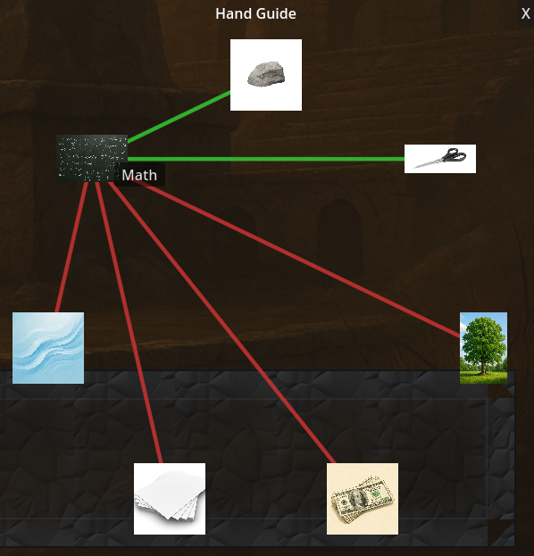
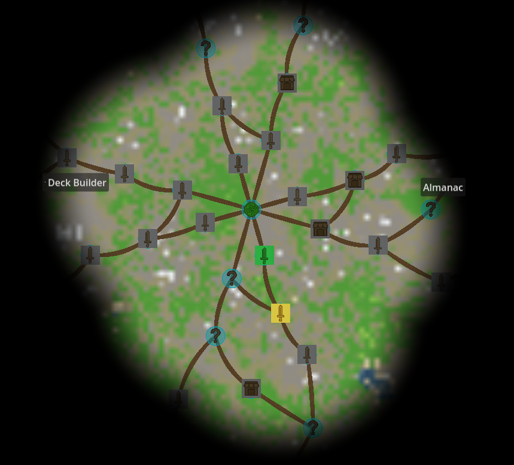

# Individual Report – Nikolai Olav Stubø
**NOTE**: Images will load when viewed on GitHub [www.github.com/Aks-l/IMT3603-RPS/](www.github.com/Aks-l/IMT3603-RPS/Reports/nikolos.md), as they are linked from there.

## Score weighting
|Description | My Weighting | 
|----|----|
|Gameplay video | 10 |
|Code video | 0 |
|Good Code  | 30 |
|Bad Code | 20 |
|Development process | 10 |
|Reflection | 30 |


## Good Code

### 1. OutcomeGraph – Outcome Visualization

To visualize what hand beats what, I created a dynamically populated outcome graph where all hands are arranged evenly around a circle. The idea is based on viewing rock–paper–scissors (and its expanded, balanced variants) as a fully connected directed graph, where each node has defined win and loss relationships to other nodes.

```gdscript
func setup_ui() -> void:
	if hands.is_empty():
		return
	
	center = custom_minimum_size / 2 if custom_minimum_size != Vector2.ZERO else size / 2
	
	var num_hands = hands.size()
	var angle_step = TAU / num_hands
	
	for i in range(num_hands):
		var hand = hands[i]
		var angle = angle_step * i - PI / 2
		
		#Calculate position on circle
		var pos = center + Vector2(cos(angle), sin(angle)) * circle_radius
		hand_positions[hand] = pos
		
		#Create button for hand
		var button = TextureRect.new()
		button.texture = hand.sprite
		button.custom_minimum_size = Vector2(hand_icon_size, hand_icon_size)
		button.position = pos - Vector2(hand_icon_size, hand_icon_size) / 2
		
		button.mouse_entered.connect(_on_hand_hover.bind(hand))
		button.mouse_exited.connect(_on_hand_unhover)
		button.tooltip_text = hand.name.capitalize()
		
		add_child(button)
		hand_buttons[hand] = button
```

*Circular layout from [outcome_graph.gd](/ui/components/outcome_graph.gd)*

The layout is calculated at runtime. The total angle of a circle is divided by the number of hands to get an angle step, and each hand’s position is calculated using cosine and sine to place it on a fixed-radius circle around the center of the UI element. The center point is derived either from the control’s custom minimum size or its actual size, depending on which is available, so the graph works correctly in different layouts.

For each hand, a `TextureRect` is created programmatically rather than placed in the editor. The icon is centered on its calculated position by subtracting half the icon size from the position vector. Each icon connects mouse enter and exit signals to handlers that redraw the graph, highlighting outgoing and incoming relationships for the hovered hand. Tooltips are also assigned dynamically based on the hand’s name.

I’m particularly happy with how clean and readable this ended up. The circular structure makes the rules immediately understandable, and the hover interaction reinforces the relationships without adding extra UI clutter. Getting the spacing, radius, and icon size right took a few iterations, but the final result feels much more polished than earlier UI elements.



*The outcome graph showing hand relationships*

### 2. Fog of War Shader

To make the map feel more dynamic and to guide the player’s focus, I implemented a fog of war effect using a fragment shader. The shader receives an array of revealed world positions along with a count of how many are currently active. Because of engine limits, the shader caps the number of positions it loops over.

```cpp
float min_dist = 999999.0;
for (int i = 0; i < revealed_count && i < 64; i++) {
	float dist = distance(world_pos, revealed_positions[i]);
	min_dist = min(min_dist, dist);
}

float fog_alpha = 1.0;
if (min_dist < reveal_radius) {
	fog_alpha = 0.0;
} else if (min_dist < reveal_radius + fade_distance) {
	float fade_factor = (min_dist - reveal_radius) / fade_distance;
	fog_alpha = smoothstep(0.0, 1.0, fade_factor) * fog_color.a;
} else {
	fog_alpha = fog_color.a;
}
```

*Fragment shader from [fog_of_war.gdshader](/scenes/map/fog_of_war.gdshader)*

For each fragment, the shader calculates the distance between the fragment’s world position and every revealed position, keeping track of the smallest distance found. This minimum distance is then used to determine the fog’s alpha value.

If the distance is smaller than a defined reveal radius, the fog is fully transparent. If it lies within a reveal radius plus a fade distance, the alpha value is interpolated using a smoothstep function to create a gradual transition. If the fragment is outside both ranges, the fog uses its default opaque alpha value.

Taking graphics programming alongside this project helped a lot here, as I was already comfortable with fragment shaders and distance-based calculations. That said, tuning the reveal radius and fade distance still took a fair amount of experimentation to make the effect feel natural rather than harsh or muddy.


### 3. Bezier Curves with Node Avoidance

When making the map, i kept having problems with roads overlapping encounter nodes, which at times looked messy. To fix this I used bezier curves as a way of smoothly interpolating paths around encounter nodes. I learned about bezier curves in `BMA1020`, a mathematics course earlier in the programme.

```gdscript
var bezier_curve = func(start: Vector2, end: Vector2, segments: int = 16) -> PackedVector2Array:
	var points := PackedVector2Array()
	var mid = (start + end) / 2
	
	#Find nearby nodes and push control point away from them
	var push = Vector2.ZERO
	var push_radius = 120.0
	var push_strength = 60.0
	
	for node_id in pos.keys():
		var node_pos = pos[node_id]
		if node_pos == start or node_pos == end:
			continue
		var dist = mid.distance_to(node_pos)
		if dist < push_radius and dist > 0:
			var away = (mid - node_pos).normalized()
			push += away * (push_strength * (1.0 - dist / push_radius))
	
	var control = mid + push + Vector2(0, -30)
	
	for i in range(segments + 1):
		var t = float(i) / segments
		var p = (1-t)*(1-t)*start + 2*(1-t)*t*control + t*t*end
		points.append(p)
	return points
```

*Bezier generation from [map.gd](/scenes/map/map.gd)*


Each path starts with a control point at the midpoint between the start and end nodes. From there, the code checks all other node positions in the map. If a node lies within a certain radius of the midpoint (excluding the start and end nodes), it applies a “push” force to the control point. The force direction is calculated by normalizing the vector pointing away from the nearby node, and the magnitude scales based on how close the node is to the midpoint.

All these forces are accumulated and added to the control point, along with a small fixed vertical offset to avoid perfectly symmetrical curves. The final curve is generated by sampling the quadratic Bezier equation, `c=p0*(t-1)**2+2*p1*(1-t)*t+p2*t**2`, at a fixed number of segments and storing the resulting points.

The result is a path that smoothly bends around encounter nodes instead of intersecting them. The effect is subtle, and I probably spent more time on it than strictly necessary, but paths overlapping nodes looked bad enough that I couldn’t ignore it.



*The map showing fog of war effect and bezier curves avoiding nodes*
### 4. StyleBoxTexture for Event Panels (not really code, but added as I liked the result)

When styling event panels of varying sizes, I needed a solution that would preserve border detail while allowing the panel to scale with its content. I ended up using Godot’s `StyleBoxTexture`, which supports nine-slice textures.


```gdscript
[gd_resource type="StyleBoxTexture" load_steps=2 format=3]

[ext_resource type="Texture2D" path="res://ui/paneltextures/event_panel_bg3.png" id="1_uinok"]

[resource]
content_margin_left = 35.0
content_margin_top = 35.0
content_margin_right = 35.0
content_margin_bottom = 35.0
texture = ExtResource("1_uinok")
texture_margin_left = 110.0
texture_margin_top = 110.0
texture_margin_right = 110.0
texture_margin_bottom = 110.0
axis_stretch_horizontal = 1
axis_stretch_vertical = 1
```

*StyleBox resource from [event_panel_stylebox.tres](/ui/paneltextures/event_panel_stylebox.tres)*

The style resource defines content margins to control padding for UI elements and texture margins that specify which parts of the texture belong to the corners and edges. These regions remain fixed, while only the center portion stretches. Both horizontal and vertical stretch axes are enabled so the same style works for panels of many different dimensions.

This style box is reused across multiple screens, including events, the deck creator, and the almanac. I spent quite a bit of time tweaking the margin values so the borders looked correct at different sizes, but having a single reusable style resource gave the UI a much more cohesive look. Even though this isn’t complex code, it had a noticeable impact on the overall polish of the game.


## Bad Code

### 1. Duplicated Area2D Toggle Logic

When an event UI opens, input on all encounter nodes is disabled so the player can’t accidentally click another node underneath the overlay. When the event closes, input is re-enabled. I implemented this by manually traversing the scene tree to find the map, then the encounters container, then each encounter’s Area2D node, and toggling its input_pickable flag.

```gdscript
func _ready():
	set_process_input(false)
	set_process_unhandled_input(false)
	
	#Disable node inputs when event is active
	var map = get_tree().root.get_node_or_null("map")
	if map:
		var encounters_root = map.get_node_or_null("Encounters")
		if encounters_root:
			for encounter in encounters_root.get_children():
				var area = encounter.get_node_or_null("NodeShape")
				if area and area is Area2D:
					area.input_pickable = false
	
	outcome_panel.visible = false
	continue_button.pressed.connect(_on_continue_pressed)

func _exit_tree():
	#Re-enable encounter node inputs when event closes
	var map = get_tree().root.get_node_or_null("map")
	if map:
		var encounters_root = map.get_node_or_null("Encounters")
		if encounters_root:
			for encounter in encounters_root.get_children():
				var area = encounter.get_node_or_null("NodeShape")
				if area and area is Area2D:
					area.input_pickable = true
```

*Duplicated loops from [event_ui.gd](/scenes/eventScene/event_ui.gd)*

The exact same nested logic exists in two different lifecycle functions, with the only difference being whether input_pickable is set to true or false. This should clearly have been extracted into a helper function that takes a boolean parameter. It started as a quick fix, but since the code was never revisited or reviewed, the duplication remained.

### 2. Encounter Type Assignment

Encounter types are assigned during map generation using hard-coded probability thresholds. For non-start and non-boss layers, a random float is generated and compared against fixed values to decide whether an encounter becomes an event, shop, or combat node.

```gdscript
for j in per_layer:
	var id = _rid(i, j)
	
	#Determine position
	var angle = angle_start + angle_step * j
	angle += rng.randf_range(-angle_variation, angle_variation)
	var radius = layer_radius
	radius += rng.randf_range(-radius_variation, radius_variation)
	
	pos[id] = center + Vector2(cos(angle), sin(angle)) * radius
	ids.append(id)
	
	#Encounter type
	if i == 0:
		etype[id] = "Start"
	elif i == layers - 1:
		etype[id] = "Boss"
	else:
		var r = rng.randf()
		etype[id] = "Event" if r < 0.2 else "Shop" if r < 0.35 else "Combat"
layer_ids.append(ids)
```

*Type assignment from [map_generator.gd](/scenes/map/map_generator.gd)*

These probability values are magic numbers embedded directly in the logic, and the selection is implemented using nested conditional expressions. This hurts both readability and flexibility. The probabilities should have been defined as named constants and ideally exported so they could be adjusted easily. A weighted selection approach, like the one used elsewhere for events, would have been a much cleaner solution.

This code worked well enough during early testing, which is why it was never cleaned up, but it’s a clear example of technical debt.

### 3. Encounter Click Handler

The encounter click handler is an example of code that does too much in one place. It checks for mouse input, validates encounter state (reachable and not cleared), emits a click signal, selects enemies, and starts encounters, all inside a single function.

```gdscript
func _on_area_input(_vp, event: InputEvent, _shape_idx: int) -> void:
	if event is InputEventMouseButton and event.pressed and event.button_index == MOUSE_BUTTON_LEFT:
		if reachable and not cleared:
			emit_signal("clicked", encounter_id)
			if encounter_type == EncounterType.COMBAT:
				var enemy := EnemyDatabase.enemies.values().pick_random() as EnemyData
				EncounterHandler.start_encounter("Combat", {
					"enemy": enemy,
					"hand": Globals.inventory,
					"consumables": []
				})
			elif encounter_type == EncounterType.BOSS:
				var enemy := EnemyDatabase.enemies.values().pick_random() as EnemyData
				EncounterHandler.start_encounter("Boss", {
					"enemy": enemy,
					"hand": Globals.inventory,
					"consumables": []
				})			
			elif encounter_type == EncounterType.SHOP:
				EncounterHandler.start_encounter("Shop", {})
			elif encounter_type == EncounterType.EVENT:
				var event_data = EventDatabase.get_random_event()
				if event_data:
					EncounterHandler.start_encounter("Event", {"event": event_data})
				else:
					push_warning("[EncounterNode] No events available")
```

*Click handler from [encounter_node.gd](/scenes/map/encounter_node.gd)*

There is significant duplication between combat and boss encounters, where enemy selection and parameter passing are nearly identical and only the encounter type string differs. This logic should have been refactored into shared helper functions or moved into encounter-type-specific handlers.

As it stands, the function violates *DRY* principles and mixes input handling with gameplay logic, making it harder to maintain or extend.

## AI usage

Throughout the projectwork I have made frequent use of AI tools such as *Copilot* and *ChatGPT*. I have tried to keep usage to only generating code I both understand and believe I myself could have written. It has also been very useful when debugging, especially given my inexperience with Godot and GDScript. I have also used AI to help guide me on what nodes to use and how to structure them in scenes. 

That being said I have found that AIs currently have some issues when it comes to generating GDScript code, with a recurring problem that it uses 3.x syntax and methods that no longer work on Godot 4.x. It has also has some issues in terms of working with scene-files (.tscn) directly, and as a result I have had to make sure it doesnt touch those, while also having to review the code carefully for Godot 4.x compatibility.

Overall I believe the use of AI has helped both in terms of developement speed and learning, with the lack of full automation actually helping me learn as there is no way to simply *fire and forget*.


## Reflection

One of the bigger challenges we ran into wasn't even technical, it was organizational. Early on a group member kind of disappeared without really saying anything. We had divided work based on the six animal model for team roles, so losing someone threw things off. Tasks that were supposed to be theirs had to get picked up by the rest of us, and some of us ended up doing stuff we weren't originally planning for. Looking back, I think I underestimated how much a team's dynamic depends on everyone being upfront about their situation. It would've been way less frustrating if they had just said something sooner so we could adjust. Going forward I want to be more proactive about checking in with people, not just assuming silence means everything is fine.

A fairly novel part of this project for me was using the *six animal model* to define team roles. Initially I was designated with the *Wolf* role, meaning my responsibility was to keep the team working together and resolve conflicts. After the group member left, I also had to take on the role of *Puppy*, focusing on being positively engaged and spurring on new ideas and trying to keep morale high. Not long after us taking on two roles each, we found that the system was too hard too follow when needing to always keep changing hats. We therefore ended up scrapping the system in lieu of just working together as a team without defined roles. This worked better for us as we already had a good dynamic and communication from previous courses.

On the technical side, I noticed my approach to Godot changed a lot over the project. At the start I was doing tons of stuff in the editor; when setting up scenes, tweaking values in the inspector and connecting signals through the UI. This felt fast at first but became a problem when things broke and I couldn't figure out why. Like, a value exported on a node might be different from what the script expects, and there's no obvious way to see that unless you dig through the scene file. This made me realize I was optimizing for the wrong thing. Speed of initial setup doesn't matter much if you end up spending twice as long debugging mysterious issues. Over time I started putting more logic in scripts where I could actually read and track what was going on. I think this shift reflects something bigger about how I approach problems now. I'd rather have something that's transparent and maybe a bit more verbose than something that's convenient but opaque.

The signal system in Godot was weird at first but once it clicked it made a lot of sense. It's basically just the observer pattern built into the engine. What I found interesting was how it changed the way I thought about dependencies between systems. Instead of asking *"what does this code need to call?"* I started asking *"what events does this code care about?"* That mental shift made the architecture feel cleaner even when the actual code wasn't perfect.

Procedural map layout generation was probably where I learned the most. I had to actually think about graph algorithms in a practical way. Making sure all nodes stay connected while also looking organic meant constantly balancing randomness with constraints. What surprised me was how much of the work was aesthetic, making adjustments to node placement and edge curvature. The generator could produce valid graphs early on, but they looked wrong. Learning to translate "this looks bad" into specific parameters to tweak was a skill I hadn't really developed before.

Taking graphics programming at the same time as this project gave me a weird dual perspective. In that course we focused on the math and theory, here I had to actually make something work in a game context. Creating the shaders was good practice and wound up helping me gain more understanding for how to implement visual effects through shaders rather than the editor. It felt good to see the connection between theory and practice, even if my implementation wasn't as clean as I would've liked.

One thing that surprised me was how much time went into making things feel right rather than just work. I used to think of polish as something you add at the end, but this project taught me that feel is part of the core functionality. A map that's technically correct but looks random isn't really finished. I'm not sure I fully internalized this lesson yet, but I'm more aware of it now.

Also learned how easy it is to let code quality slip when you're trying to get features done. The bad code examples I mentioned are all things I knew weren't great when I wrote them but I kept going because they worked. I told myself I'd refactor later, and then later never came. If I'm being honest, I think I prioritized visible progress over sustainable code. That's something I want to be more careful about in future projects - not because clean code is inherently valuable, but because messy code has a way of slowing you down exactly when you can least afford it.

Overall, this project has been a learning experience on multiple levels. Both in terms of tehnical skills; Godot, shaders, procedural generation, and in terms of teamwork and project management. In particular I think I've grown more aware of how my choices as a developer affect the codebase. And I will endeavor to make a concerted effort to write cleaner, more maintainable code in future projects.

